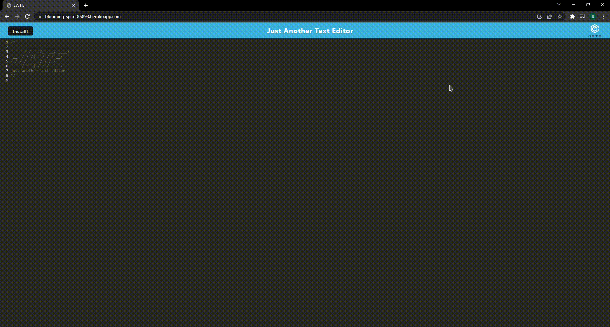

<!-- proj name -->

# Just Another Text Editor

<!-- project shields -->

<!-- toc -->

## Table of Contents

- [Just Another Text Editor](#title)
- [About Just Another Text Editor](#about-proj)
- [Getting Started](#getting-started)
- [Usage](#Usage)
- [Testing](#testing)
- [Contributing](#contributing)
- [License](#license)
- [Contact Me](#contact-me)

<!-- about project -->

## About Just Another Text Editor

JATE is just another text editor. This program can be used both in and outside of the browser utilizing PWA technology. Text will be saved and the website is accessible both on and offline.

<!-- Getting Started -->

## Getting Started
This is how you can get started using Just Another Text Editor locally. Begin by following these instructions.
### Installation

  As a Dev - Clone the repository, in the root dir run `npm i`.   As a User - Go to [JATE](https://blooming-spire-85893.herokuapp.com/) and click the 'Install' button, or use the tool in the browser.

<!-- Usage -->

## Usage

To use JATE:   As a Dev - In the root dir `npm run start` to begin JATE. The program will operate at localhost:3000. To exit this process crtl+c in terminal and in browser>DevTools>Application Unregister 'Source' to clear localhost service worker.  As a User - Go to [JATE](https://blooming-spire-85893.herokuapp.com/) and begin editing text!

<!-- Testing -->

## Testing

To test this application follow the [installation](#Install) and [usage](#Usage) processes if any errors are to occur reference the [contributions] section of this document.

<!-- Contributing -->

## Contributing

To contribute to this project email me or open an issue on the repository describing your issue(s).

<!-- Contact Me -->

## Contact Me
- [zortro](https://github.com/zortro)
- ben.r.dominguez@gmail.com

This readme file was generated using [ReadMe Generator](https://github.com/zortro/readme-generator/)